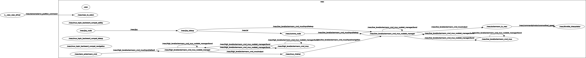
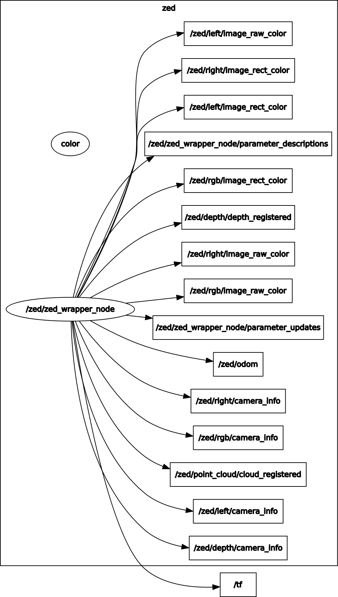

# Setup after checking out
if the computer doesn't have the following packages installed you can
```
git clone https://github.com/ros-drivers/ackermann_msgs.git src/ackermann_msgs
git clone https://github.com/wjwwood/serial.git src/serial
```
or
```
sudo apt-get install ros-kinetic-ackermann-msgs
sudo apt-get install ros-kinetic-serial
```

To build and set environment variables
```
catkin_make
. devel/setup.sh
```


# To run everything on the car
```
roslaunch the_robotics_club mit-car.launch
```

# To observe the camera remotely with rqt_gui
```
export ROS_MASTER_URI=http://x.x.x.x:11311 the_robotics_club observer.launch
```


# How to watch the GPU memory usage
looks like the Zed uses about 1850/7850MB just being in the desktop with a few terminals and gedit running
```
sudo ~/tegrastats
```


# Nodes and topics



